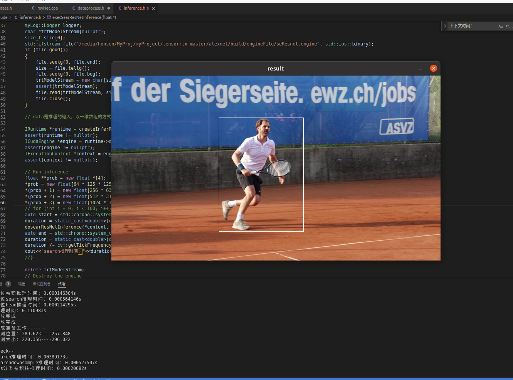

# TRT_with_HPC-for-learning
a project for learning HPC

本项目目前只做了siammask的cls和loc两个分支的推理部分和实现。其中使用C/C++实现了python的一些矩阵操作。个人能力有限，一些计算设计不太合理。还需提高。所有关于对推理结果进行transform和对输入图片数据进行transform的代码都在dataprocess.h里面。其中dataprocess.h对应了siammask官方python项目代码中test.py文件中的数据处理部分代码。

inference.h是使用tensorrt进行推理的部分。但是当前所学有限，所以使用的方法比较笨。后续还要研究。（主要是将整个网络分成各个TRT支持的好几个部分进行推理，所以对应的ONNX文件也是被分成了好几个部分。onnx文件没有上传因为比较大）

state.h和trackConfig.h两个是我对应于siammask官方python代码中相关部分所写的C++版。

如果感兴趣如何用TRT推理siammask可以主要看看dataprocess.h文件。

siammask官方代码直接在GitHub搜索siammask出现的第一个就是。是一个单目标跟踪算法基于SiamRPN带有分割功能。

